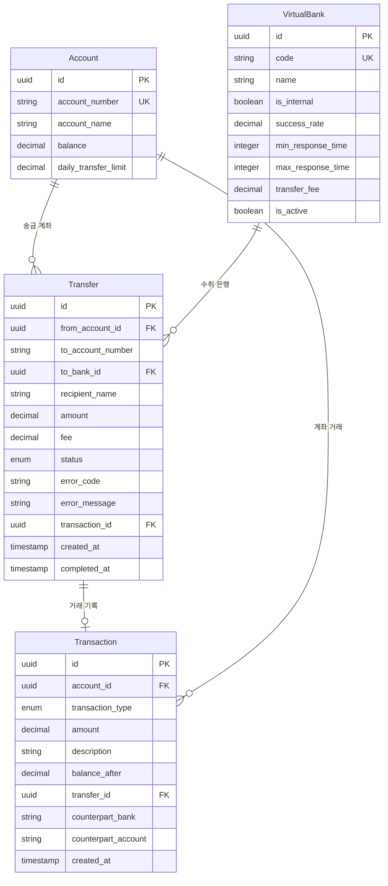

# 데이터 모델: 계좌 이체 기능

**기능**: 계좌 이체 기능  
**브랜치**: `002-transfer`  
**날짜**: 2025-11-07  
**상태**: 완료됨

## 개요

이체 기능을 위한 데이터 모델 설계입니다. 기존의 Account와 Transaction 모델을 확장하여 Transfer와 VirtualBank 모델을 추가합니다.

## 엔티티 정의

### Transfer (이체)

이체 요청 및 처리 정보를 관리하는 핵심 엔티티입니다.

**속성**:
- `id` (UUID, PK): 이체 고유 식별자
- `from_account_id` (UUID, FK): 송금 계좌 ID (Account 참조)
- `to_account_number` (VARCHAR(20), Not Null): 수취 계좌번호
- `to_bank_id` (UUID, FK): 수취 은행 ID (VirtualBank 참조, NULL 가능 - 내부 이체)
- `recipient_name` (VARCHAR(100), Not Null): 받는분 성명
- `amount` (DECIMAL(15,2), Not Null): 이체 금액
- `fee` (DECIMAL(10,2), Default 0): 이체 수수료
- `status` (ENUM, Not Null): 이체 상태
- `error_code` (VARCHAR(10), NULL): 오류 코드 (실패 시)
- `error_message` (VARCHAR(500), NULL): 오류 메시지 (실패 시)
- `transaction_id` (UUID, FK): 연관된 거래 내역 ID (Transaction 참조, 성공 시)
- `created_at` (TIMESTAMP, Not Null): 이체 요청 시간
- `completed_at` (TIMESTAMP, NULL): 이체 완료 시간

**상태 열거형** (TransferStatus):
- `PENDING`: 처리 대기중
- `IN_PROGRESS`: 처리중
- `COMPLETED`: 완료
- `FAILED`: 실패
- `CANCELLED`: 취소됨

**검증 규칙**:
- `amount` > 0
- `amount` <= 1,000,000 (1백만원 한도)
- `to_account_number` 형식 검증 (은행별)
- `recipient_name` 2-100자

### VirtualBank (가상 은행)

가상 은행 정보 및 시뮬레이션 설정을 관리합니다.

**속성**:
- `id` (UUID, PK): 은행 고유 식별자
- `code` (VARCHAR(10), Unique, Not Null): 은행 코드 (예: "004", "088")
- `name` (VARCHAR(50), Not Null): 은행명
- `is_internal` (BOOLEAN, Default False): 내부 은행 여부
- `success_rate` (DECIMAL(5,2), Default 95.00): 성공률 (%)
- `min_response_time` (INTEGER, Default 500): 최소 응답 시간 (ms)
- `max_response_time` (INTEGER, Default 2000): 최대 응답 시간 (ms)
- `transfer_fee` (DECIMAL(10,2), Default 500): 이체 수수료
- `is_active` (BOOLEAN, Default True): 활성 상태

**검증 규칙**:
- `success_rate` 0-100 범위
- `min_response_time` <= `max_response_time`
- `transfer_fee` >= 0

### Account (기존 모델 확장)

기존 Account 모델에 이체 관련 필드 추가.

**추가 속성**:
- `daily_transfer_limit` (DECIMAL(15,2), Default 5000000): 일일 이체 한도
- `remaining_daily_limit` (DECIMAL(15,2)): 잔여 일일 한도 (계산 필드)

### Transaction (기존 모델 확장)

이체 완료 시 자동 생성되는 거래 내역.

**추가 거래 타입**:
- `TRANSFER_OUT`: 이체 출금
- `TRANSFER_IN`: 이체 입금 (향후 확장용)

**추가 속성**:
- `transfer_id` (UUID, FK): 연관된 이체 ID (Transfer 참조, NULL 가능)
- `counterpart_bank` (VARCHAR(50), NULL): 상대방 은행명 (타행 이체시)
- `counterpart_account` (VARCHAR(20), NULL): 상대방 계좌번호

## 관계 다이어그램



## 인덱스 설계

### Transfer 테이블 인덱스

```sql
-- 계좌별 이체 내역 조회
CREATE INDEX idx_transfer_from_account_created 
ON transfer(from_account_id, created_at DESC);

-- 상태별 이체 조회 (모니터링)
CREATE INDEX idx_transfer_status_created 
ON transfer(status, created_at DESC);

-- 수취 계좌별 조회 (중복 이체 체크)
CREATE INDEX idx_transfer_to_account_created 
ON transfer(to_account_number, to_bank_id, created_at DESC);
```

### Transaction 테이블 인덱스 (추가)

```sql
-- 이체 연관 거래 조회
CREATE INDEX idx_transaction_transfer_id 
ON transaction(transfer_id);

-- 타행 이체 거래 조회
CREATE INDEX idx_transaction_counterpart 
ON transaction(counterpart_bank, counterpart_account);
```

## 데이터 마이그레이션

### 1. VirtualBank 초기 데이터

```sql
INSERT INTO virtual_bank (id, code, name, is_internal, success_rate, min_response_time, max_response_time, transfer_fee) VALUES
('uuid-1', '004', '국민은행', false, 95.00, 500, 2000, 500.00),
('uuid-2', '088', '신한은행', false, 97.00, 800, 1500, 500.00),
('uuid-3', '020', '우리은행', false, 93.00, 1000, 3000, 500.00),
('uuid-4', '081', '하나은행', false, 96.00, 700, 2500, 500.00),
('uuid-5', '003', '기업은행', false, 94.00, 1200, 2800, 500.00),
('uuid-6', 'INTERNAL', '내부은행', true, 99.99, 100, 300, 0.00);
```

### 2. Account 테이블 스키마 변경

```sql
ALTER TABLE account 
ADD COLUMN daily_transfer_limit DECIMAL(15,2) DEFAULT 5000000.00;
```

### 3. Transaction 테이블 스키마 변경

```sql
ALTER TABLE transaction 
ADD COLUMN transfer_id UUID REFERENCES transfer(id),
ADD COLUMN counterpart_bank VARCHAR(50),
ADD COLUMN counterpart_account VARCHAR(20);

-- 새로운 거래 타입 추가
ALTER TYPE transaction_type ADD VALUE 'TRANSFER_OUT';
ALTER TYPE transaction_type ADD VALUE 'TRANSFER_IN';
```

## 데이터 무결성 규칙

### 비즈니스 규칙

1. **잔액 검증**: 이체 금액 + 수수료 <= 계좌 잔액
2. **한도 검증**: 이체 금액 <= 잔여 일일 한도
3. **중복 방지**: 동일 수취계좌로 1분 내 중복 이체 불가
4. **상태 전이**: PENDING → IN_PROGRESS → (COMPLETED|FAILED)

### 트랜잭션 처리

```sql
-- 이체 처리 트랜잭션 예시
BEGIN;

-- 1. 잔액 확인 및 차감
UPDATE account 
SET balance = balance - (이체금액 + 수수료)
WHERE id = 송금계좌ID 
AND balance >= (이체금액 + 수수료);

-- 2. 이체 기록 생성
INSERT INTO transfer (...) VALUES (...);

-- 3. 거래 내역 기록
INSERT INTO transaction (...) VALUES (...);

-- 4. 이체 상태 업데이트
UPDATE transfer SET status = 'COMPLETED', completed_at = NOW() WHERE id = 이체ID;

COMMIT;
```

## 보안 고려사항

### 데이터 보호

- **민감 정보**: 수취계좌번호, 받는분성명은 로그에 기록하지 않음
- **오류 정보**: 사용자에게는 일반화된 메시지, 시스템에는 상세 오류 기록
- **감사 추적**: 모든 이체 시도는 성공/실패 무관하게 기록

### 접근 제어

- Transfer 데이터는 송금자 본인만 조회 가능
- VirtualBank 설정은 관리자만 수정 가능
- 거래 내역은 계좌 소유자만 조회 가능

## 성능 고려사항

### 조회 최적화

- 최근 이체 내역 우선 조회 (인덱스 활용)
- 페이지네이션으로 대용량 데이터 처리
- 상태별 필터링 최적화

### 동시성 제어

- 계좌 잔액 업데이트 시 row-level lock
- 이체 상태 변경 시 optimistic locking
- 중복 이체 방지를 위한 unique constraint

## 확장 계획

### 향후 기능 확장

1. **정기 이체**: Transfer 테이블에 recurring 설정 추가
2. **해외 송금**: VirtualBank에 국가 코드 추가
3. **대량 이체**: BatchTransfer 테이블 추가
4. **이체 예약**: Transfer에 scheduled_at 필드 추가

### 성능 확장

- 이체 내역 아카이빙 (6개월 이상 데이터)
- 읽기 전용 replica DB 활용
- 캐시 계층 도입 (은행 정보, 계좌 한도 등)